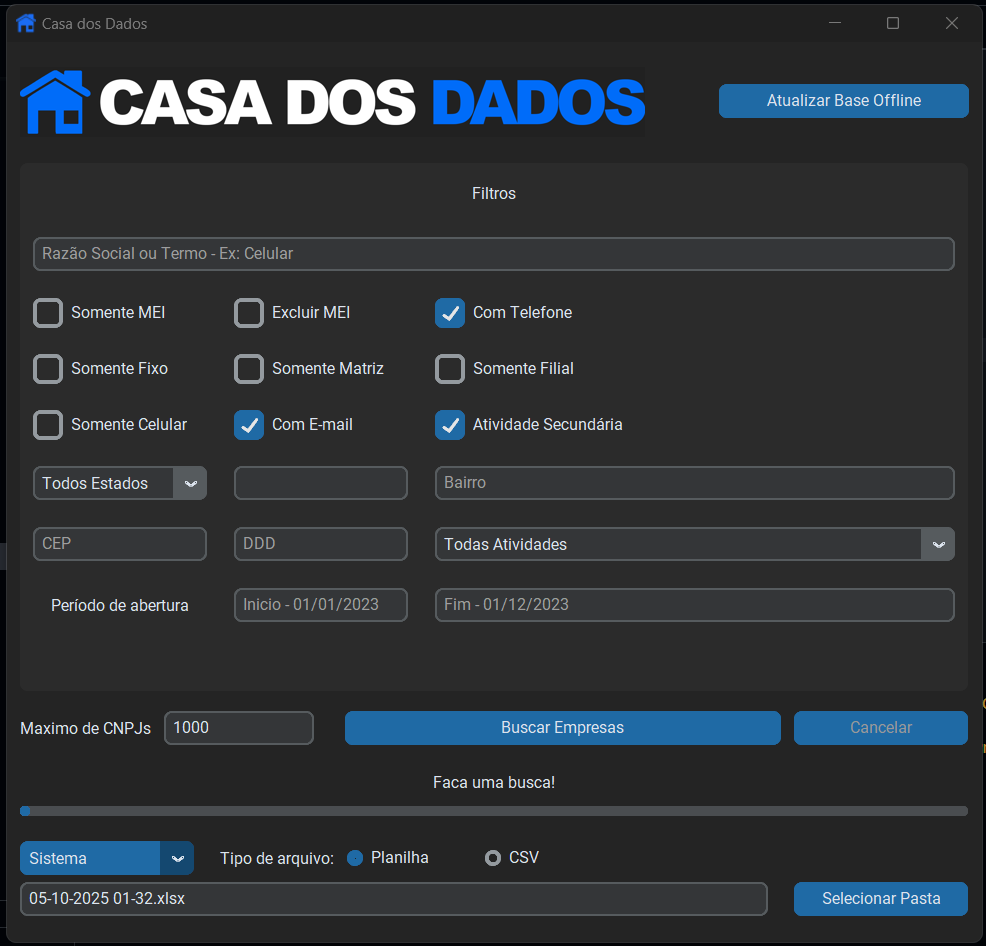

# Casa dos Dados Offline


## Atualizacao 04/10/2025

Este projeto deixou de ser um scraper do site Casa dos Dados. Agora ele funciona exclusivamente com um banco de dados offline, construido a partir dos dados publicos disponibilizados pela Receita Federal. O objetivo e oferecer consultas rapidas e estaveis sem depender do site original.

> Esta mudanca elimina o uso de Playwright ou qualquer automacao de navegadores. Todo o fluxo passa a depender do banco sqlite gerado localmente.



## Sobre o projeto

- Ferramenta com interface amigavel para explorar dados do CNPJ de forma offline.
- O banco `cnpj.db` precisa ser gerado pelo usuario a partir dos dados publicos oficiais.
- O desempenho depende da maquina local, mas as consultas nao sofrem limites de resultado impostos pelo site.

### Preparando a base de dados offline

Para gerar e atualizar o banco sqlite usado pela aplicacao, utilize o projeto [`rictom/cnpj-sqlite`](https://github.com/rictom/cnpj-sqlite).

1. Clone ou baixe o repositorio:
   ```
   git clone https://github.com/rictom/cnpj-sqlite.git
   cd cnpj-sqlite
   ```
2. Instale as dependencias listadas pelo projeto:
   ```
   pip install -r requirements.txt
   ```
3. Baixe os arquivos publicos da Receita Federal:
   ```
   python dados_cnpj_baixa.py
   ```
4. Converta os arquivos baixados para sqlite:
   ```
   python dados_cnpj_para_sqlite.py
   ```
5. Ao final, o script gera o arquivo `cnpj.db`. Copie (ou mova) esse arquivo para a pasta `dados-publicos` deste projeto, substituindo o arquivo existente:
   ```
   C:\Users\...\CasaDosDadosOffline\dados-publicos\cnpj.db
   ```

> O processo completo pode exigir mais de 60 GB livres (temporarios + banco final). Remova os arquivos zipados apos a conversao caso precise liberar espaco.

### Ajustes e melhorias

O projeto continua em desenvolvimento. As proximas atualizacoes planejadas sao:

- [x] Consultas offline a partir de sqlite
- [x] Interface amigavel
- [ ] Salvar filtros
- [x] Exportar em outros formatos (.csv etc)
- [x] Gerar instalador
- [x] Gerar executavel portavel

## Pre-requisitos

Antes de comecar, verifique se voce atende aos seguintes requisitos:

* Python 3.11 ou superior instalado (apenas para executar via codigo fonte).
* Windows 10 ou superior para utilizar os binarios fornecidos.
* Arquivo `cnpj.db` gerado pelo projeto [`rictom/cnpj-sqlite`](https://github.com/rictom/cnpj-sqlite).

## Instalando

Para instalar, siga estas etapas:

- Visite a pagina de [releases](https://github.com/guilhermecugler/Scraper-Casa-dos-Dados/releases/) do repositorio.
- Baixe a versao mais [recente](https://github.com/guilhermecugler/Scraper-Casa-dos-Dados/releases/latest).
- Escolha entre a versao portavel ou a instalavel (esta inicia mais rapido).
- Execute e utilize normalmente. Certifique-se de ter o `cnpj.db` na pasta `dados-publicos` antes da primeira abertura.

## Executando a partir do codigo fonte

Windows:
```
1. Clone este repositorio:
   git clone https://github.com/guilhermecugler/Scraper-Casa-dos-Dados.git

2. Navegue ate a pasta clonada

3. Instale as dependencias:
   pip install -r .\requirements.txt

4. Certifique-se de que o arquivo dados-publicos\cnpj.db existe e foi gerado via cnpj-sqlite

5. Execute a aplicacao:
   python .\casadosdados.py
```

## Usando

1. Gere ou atualize o banco sqlite seguindo a secao "Preparando a base de dados offline".
2. Abra o aplicativo (executavel ou via `python`).
3. Realize suas consultas; todas as buscas sao feitas localmente no arquivo `cnpj.db`.

## Contribuindo

Para contribuir, siga estas etapas:

1. Bifurque este repositorio.
2. Crie um branch: `git checkout -b <nome_branch>`.
3. Faca suas alteracoes e confirme-as: `git commit -m '<mensagem_commit>'`
4. Envie para o branch original: `git push origin <nome_do_branch>`
5. Crie a solicitacao de pull.

Como alternativa, consulte a documentacao do GitHub em [como criar uma solicitacao pull](https://help.github.com/en/github/collaborating-with-issues-and-pull-requests/creating-a-pull-request).

## Colaboradores

O projeto e mantido por mim.

<div style="display: flex;">
  <table>
    <tr>
      <td align="center">
        <a href="https://github.com/guilhermecugler">
          <br>
          <sub>
            <b>Guilherme Cugler</b>
          </sub>
        </a>
      </td>
    </tr>
  </table>
</div>

## Seja um dos contribuidores

Se estiver contribuindo com o projeto, adicione seu nome de usuario do GitHub ao arquivo CONTRIBUTORS.md.

## Licenca

Este projeto esta sob licenca GNU General Public License v3.0. Veja [LICENCA](https://www.gnu.org/licenses/gpl-3.0.en.html) para mais detalhes.
